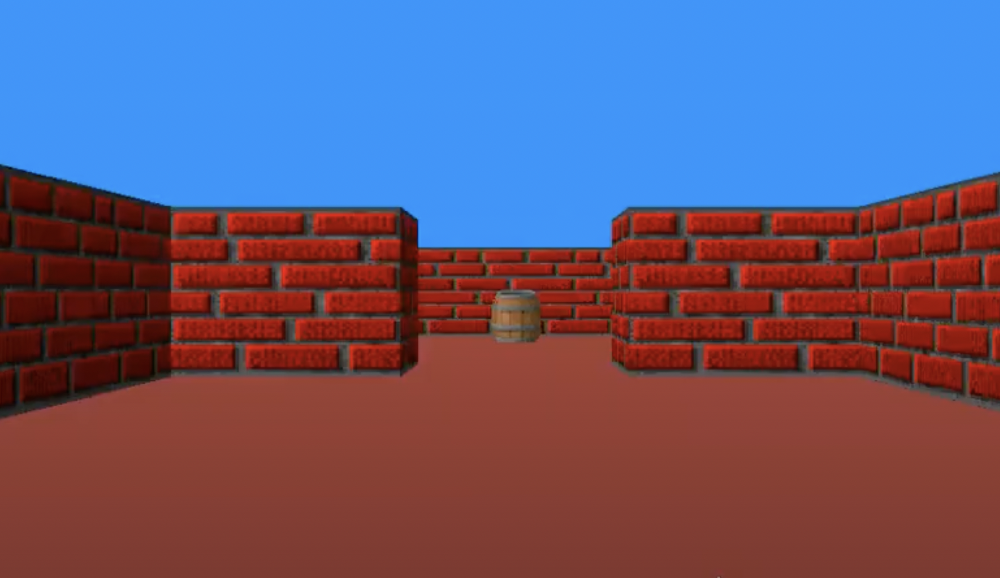

# Wolf3D

Трехмерное представление лабиринта от первого лица с использованием технологии raycasting, аналогично Wolfenstein 3D (1992).



## О проекте

Проект запускается с использованием MiniLibX, поэтому он может работать только в Linux.

Для сборки проекта необходимо выполнить команду ``make``, которая создаст исполняемый файл.

Далее запустите исполняемый файл с помощью
```
./wolf_3D argument1  [argument2]
```
В качестве ``argument1`` вы можете указать любую карту из директории ``maps``.
Если указать вторым аргументом ``--save``, то программа сохранит первое визуализированное изображение в файл формата ``.bmp``.

## Управление

```
W	- движение вперед
A	- движение влево
S	- движение вправо
D	- движение назад
←	- поворот влево
→	- поворот вправо
ESC	- выход из программы
```
